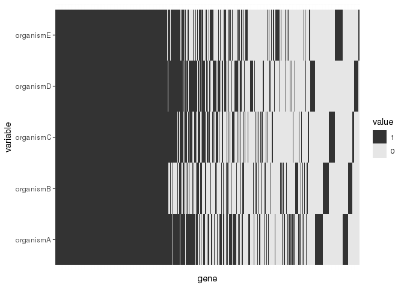
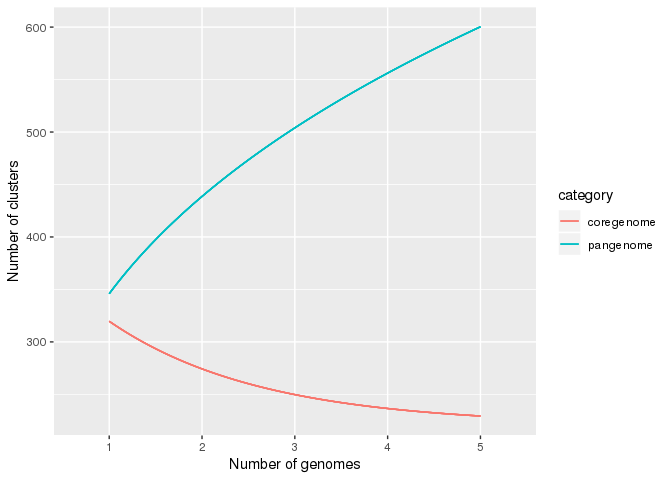
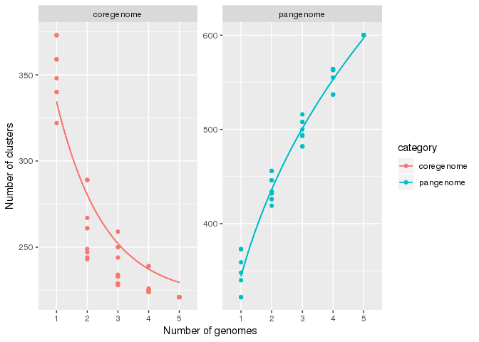

Pagoo: An encapsulated OO class system for analyzing bacterial pangenomes
================
Ignacio Ferrés
April 26, 2019

*"One object to store them all, one object to find them, one object to query from and with ggplot2 visualize them." (Lord Sauron)*

Introduction
------------

This package provides an encapsulated Object Oriented class system for analyzing bacterial pangenomes. It uses the [R6](https://r6.r-lib.org/) package as backend. It was designed in order to facilitate and speed up **a lot** my projects as a microbial genomics researcher, standardizing and optimizing routine tasks of my everyday work activities.

A few years on this field made me realize that there are three things I do almost every day when working with bacterial pangenomes:

1.  Subset
2.  Apply statistical methods
3.  Visualize

so I wanted to have all these three tasks as light and easy for me as possible.

This package comes with three R6 classes, each one more complex than the other, and that the more basic ones are inherited by the more complex ones. The most basic one, `PgR6`, contains basic subset methods and data manipulation functions. The second one, `PgR6M` inherits all the methods and fields from the previous one, and incorporates statistical and visualization methods. The last one, `PgR6MS`, inherits from `PgR6M` all its capabilities, and adds methods for manipulate DNA sequences.

It is worth noting that this package is intended to facilitate the analysis of pangenomes *once the pangenome of a clade has already been obtained*, so you can reconstruct the pangenome with any of your favorite tools, and use *pagoo* to analyze it.

### Installation

The easiest way to install this package is using `devtools`:

``` r
devtools::install_github('iferres/pagoo')
```

### Help

All three classes are documented. You can access R help pages as with any other function:

``` r
library(pagoo)
?PgR6
help('PgR6MS')
```

Example
-------

To show the full capabilities of `pagoo` I will use the most complex class, `PgR6MS` so you can see all the fancy things you can do. The example uses toy data that comes with the package.

### Input

First of all, lets extract and decompress the example data attached to this package:

``` r
library(pagoo)
tgz <- system.file('extdata', 'toy_data.tar.gz', package = 'pagoo')
untar(tarfile = tgz, exdir = tempdir())
files <- list.files(path = tempdir(), full.names = TRUE, pattern = 'tsv$|fasta$')
files
```

    ## [1] "/tmp/RtmpklNthp/case_df.tsv"        
    ## [2] "/tmp/RtmpklNthp/case_group_meta.tsv"
    ## [3] "/tmp/RtmpklNthp/case_orgs_meta.tsv" 
    ## [4] "/tmp/RtmpklNthp/organismA.fasta"    
    ## [5] "/tmp/RtmpklNthp/organismB.fasta"    
    ## [6] "/tmp/RtmpklNthp/organismC.fasta"    
    ## [7] "/tmp/RtmpklNthp/organismD.fasta"    
    ## [8] "/tmp/RtmpklNthp/organismE.fasta"

There are 3 `.tsv` files, and 5 `.fasta` files. The `case_df.tsv` file is the main one, having the information about the membership of each gene from each organism, to each group of orthologous (clusters). `case_*_meta.tsv` files have metadata for the clusters and for the organisms. `organism*.fasta` files have the sequences for each organism:

``` r
df <- read.table(files[1], header = TRUE, sep = '\t', quote = '')
head(df)
```

    ##      gene       org group                             annot
    ## 1 gene081 organismA OG001  Thioesterase superfamily protein
    ## 2 gene122 organismB OG001          Thioesterase superfamily
    ## 3 gene299 organismC OG001  Thioesterase superfamily protein
    ## 4 gene186 organismD OG001  Thioesterase superfamily protein
    ## 5 gene076 organismE OG001          Thioesterase superfamily
    ## 6 gene352 organismA OG002 Inherit from proNOG: Thioesterase

As you can see, `df` is a `data.frame` with 4 columns: the first one with the name of each gene, the second one with the organism to which each gene belongs, the third one with the cluster to which each gene was assigned in the pangenome reconstruction, and the last one with annotation metadata for each gene. Of the 4 columns, the former 3 are required, and `pagoo` will look for columns named "gene", "org", and "group". More columns are optional, and you can add as many as you want (or none) to add metadata of each gene.

The next 2 `.tsv` files contains metadata for each cluster and for each organism, respectively, and are optional arguments.

``` r
#
group_meta <- read.table(files[2], header = TRUE, sep = '\t', quote = '', na.strings = '<NA>')
org_meta <- read.table(files[3], header = TRUE, sep = '\t', quote = '', na.strings = '<NA>')
head(group_meta)
```

    ##   group   kegg cog
    ## 1 OG001     NA   S
    ## 2 OG002     NA   S
    ## 3 OG003     NA  NA
    ## 4 OG004     NA   D
    ## 5 OG005 K01990   V
    ## 6 OG006     NA   V

``` r
head(org_meta)
```

    ##         org sero  country
    ## 1 organismA    a Westeros
    ## 2 organismB    b Westeros
    ## 3 organismC    c Westeros
    ## 4 organismD    a    Essos
    ## 5 organismE    b    Essos

In both cases, the columns identifying each cluster and each organism must coincide with the names provided in the first data frame, so `pagoo` can map the metadata correctly.

As we will be working with the class `PgR6MS` in this example, DNA sequences are also required. The other 2 classes are lightweight, and don't use all this data, so keep it in mind you can work without sequences if you have limited computational resources.

``` r
suppressMessages(library(Biostrings))
fasta_files <- files[4:8]
names(fasta_files) <- sub('[.]fasta', '', basename(fasta_files))
# A list of DNAStringSet, with organism names as list names, and DNAString names as gene names:
seqs <- lapply(fasta_files, readDNAStringSet)
```

Keep in mind that names should match with those provided in the data frames before.

### Load class

Once we have all the input data, lets load the example into a `PgR6MS` class:

``` r
pg <- PgR6MS$new(DF = df, org_meta = org_meta, group_meta = group_meta, sequences = seqs)
pg
```

    ## <PgR6MS>
    ##   Inherits from: <PgR6M>
    ##   Public:
    ##     binomix_estimate: function (K.range = 3:5, core.detect.prob = 1, verbose = TRUE) 
    ##     cg_exp_decay_fit: function (raref, pcounts = 10, ...) 
    ##     clone: function (deep = FALSE) 
    ##     cloud_clusters: active binding
    ##     cloud_genes: active binding
    ##     cloud_sequences: active binding
    ##     clusters: active binding
    ##     core_clusters: active binding
    ##     core_genes: active binding
    ##     core_level: active binding
    ##     core_seqs_4_phylo: function (max_per_org = 1, fill = TRUE) 
    ##     core_sequences: active binding
    ##     dist: function (method = "bray", binary = FALSE, diag = FALSE, upper = FALSE, 
    ##     drop: function (x) 
    ##     dropped: active binding
    ##     fluidity: function (n.sim = 10) 
    ##     genes: active binding
    ##     gg_barplot: function () 
    ##     gg_binmap: function () 
    ##     gg_curves: function (what = c("pangenome", "coregenome"), ...) 
    ##     gg_dist: function (method = "bray", ...) 
    ##     gg_pca: function (colour = NULL, ...) 
    ##     gg_pie: function () 
    ##     initialize: function (DF, org_meta, group_meta, sep = "__", sequences) 
    ##     organisms: active binding
    ##     pan_matrix: active binding
    ##     pan_pca: function (center = TRUE, scale. = FALSE, ...) 
    ##     pg_power_law_fit: function (raref, ...) 
    ##     random_seed: active binding
    ##     rarefact: function (what = "pangenome", n.perm = 10) 
    ##     recover: function (x) 
    ##     sequences: active binding
    ##     shell_clusters: active binding
    ##     shell_genes: active binding
    ##     shell_sequences: active binding
    ##     summary_stats: active binding
    ##   Private:
    ##     .DF: DataFrame
    ##     .dropped: NULL
    ##     .groups: DataFrame
    ##     .level: 95
    ##     .organisms: DataFrame
    ##     .panmatrix: 1 1 1 1 1 1 1 1 1 0 1 0 1 1 0 1 1 1 1 1 1 1 1 1 1 1 1 1  ...
    ##     .sep: __
    ##     .sequences: DNAStringSet
    ##     version: package_version, numeric_version

Wow. I know. A better print method will be written in the future, this is the default print method for `R6` classes. But you can see that basically there are public and private fields/methods. In private, all raw data is stored. You will not have easy access to it. Instead, you will be able to access public functions and active bindings. Active bindings are functions that behave as it were variables, you will understand it better with some examples below.

### 0. Basic fields and functions

What do you want from a pangenome? Well, let see some examples:

``` r
# Get a panmatrix
pg$pan_matrix[, 1:5]
```

    ##           OG001 OG002 OG003 OG004 OG005
    ## organismA     1     1     1     1     1
    ## organismB     1     1     0     1     1
    ## organismC     1     1     1     1     1
    ## organismD     1     1     1     1     1
    ## organismE     1     0     0     1     1

``` r
# Get organism information
pg$organisms
```

    ## DataFrame with 5 rows and 3 columns
    ##           org     sero  country
    ##   <character> <factor> <factor>
    ## 1   organismA        a Westeros
    ## 2   organismB        b Westeros
    ## 3   organismC        c Westeros
    ## 4   organismD        a    Essos
    ## 5   organismE        b    Essos

``` r
# Get cluster information
pg$clusters
```

    ## DataFrame with 600 rows and 3 columns
    ##           group     kegg      cog
    ##     <character> <factor> <factor>
    ## 1         OG001       NA        S
    ## 2         OG002       NA        S
    ## 3         OG003       NA       NA
    ## 4         OG004       NA        D
    ## 5         OG005   K01990        V
    ## ...         ...      ...      ...
    ## 596       OG596       NA        L
    ## 597       OG597       NA        H
    ## 598       OG598       NA        S
    ## 599       OG599       NA       NA
    ## 600       OG600       NA       NA

``` r
# Get gene information
pg$genes
```

    ## SplitDataFrameList of length 600
    ## $OG001
    ## DataFrame with 5 rows and 2 columns
    ##                  gid                            annot
    ##          <character>                         <factor>
    ## 1 organismA__gene081 Thioesterase superfamily protein
    ## 2 organismB__gene122         Thioesterase superfamily
    ## 3 organismC__gene299 Thioesterase superfamily protein
    ## 4 organismD__gene186 Thioesterase superfamily protein
    ## 5 organismE__gene076         Thioesterase superfamily
    ## 
    ## $OG002
    ## DataFrame with 4 rows and 2 columns
    ##                  gid                             annot
    ##          <character>                          <factor>
    ## 1 organismA__gene352 Inherit from proNOG: Thioesterase
    ## 2 organismB__gene145 Inherit from proNOG: Thioesterase
    ## 3 organismC__gene251 Inherit from proNOG: Thioesterase
    ## 4 organismD__gene299 Inherit from proNOG: Thioesterase
    ## 
    ## $OG003
    ## DataFrame with 3 rows and 2 columns
    ##                  gid    annot
    ##          <character> <factor>
    ## 1 organismA__gene359       NA
    ## 2 organismC__gene237       NA
    ## 3 organismD__gene069       NA
    ## 
    ## ...
    ## <597 more elements>

``` r
# Get sequences
pg$sequences
```

    ## DNAStringSetList of length 600
    ## [["OG001"]] organismA__gene081=ATGGAATCGGAAACAATCTTTCGGGAAATCAAAGCAAGCCA...
    ## [["OG002"]] organismA__gene352=ATGACAGATATACAGATTGAATTTCCGGAGAACTATCATTT...
    ## [["OG003"]] organismA__gene359=TTGTTTTTTTATTTCACATTATGGATCACAAAAAGGATCGG...
    ## [["OG004"]] organismA__gene258=ATGAAACAGATCCTCTGTATTGCAAACCAGAAAGGCGGAGT...
    ## [["OG005"]] organismA__gene118=ATGATCAAAGTTAAAAACCTATCTAAATTCTATGGCAAAAA...
    ## [["OG006"]] organismA__gene348=GTGAGTCTGATCAAAGTAAGAAATTTGGTAAAGAATTATCA...
    ## [["OG007"]] organismA__gene140=ATGAAGTTTTTTTTCAGACTTCTATCCTATTCCGTACATTA...
    ## [["OG008"]] organismB__gene075=ATGATTCAAAAAGCGAATTATAAACAGATTTTATTAGAATT...
    ## [["OG009"]] organismB__gene328=ATGAATGATTATCTCACGTACGTATCTGACAATCGTTCCGT...
    ## [["OG010"]] organismA__gene013=ATGAGCGAAATTGAAAGCGGTTTTTTTCAATCCGGCGGGTA...
    ## ...
    ## <590 more elements>

``` r
# Access each cluster
pg$sequences[[1]]
```

    ##   A DNAStringSet instance of length 5
    ##     width seq                                          names               
    ## [1]   576 ATGGAATCGGAAACAATCTTT...TTCAAAAGACGGATTCCTGA organismA__gene081
    ## [2]   576 ATGGAACCAGAGGCAATCTAC...TTCAAAACATAGAACCCTAA organismB__gene122
    ## [3]   576 ATGGATACGGAAACGATCTAC...TTCAAAAGGTAAATTCTTAA organismC__gene299
    ## [4]   576 ATGGAAACAGAAACAATCTAC...TTCAAAAGGTAAATTCCTAG organismD__gene186
    ## [5]   576 ATGGAATCAGAGGCAATCTAC...TTCAAAAGATAATTTCCTAG organismE__gene076

``` r
# What is the default core level?
pg$core_level #You can change it by assiging another value (<=100)
```

    ## [1] 95

``` r
# Get core clusters
pg$core_clusters
```

    ## DataFrame with 221 rows and 3 columns
    ##           group          kegg      cog
    ##     <character>      <factor> <factor>
    ## 1         OG001            NA        S
    ## 2         OG004            NA        D
    ## 3         OG005        K01990        V
    ## 4         OG006            NA        V
    ## 5         OG007 K06147,K11085        V
    ## ...         ...           ...      ...
    ## 217       OG429            NA       NA
    ## 218       OG430            NA       NA
    ## 219       OG431            NA        S
    ## 220       OG436            NA        G
    ## 221       OG444            NA       NA

``` r
# Get shell genes
pg$shell_genes
```

    ## SplitDataFrameList of length 151
    ## $OG002
    ## DataFrame with 4 rows and 2 columns
    ##                  gid                             annot
    ##          <character>                          <factor>
    ## 1 organismA__gene352 Inherit from proNOG: Thioesterase
    ## 2 organismB__gene145 Inherit from proNOG: Thioesterase
    ## 3 organismC__gene251 Inherit from proNOG: Thioesterase
    ## 4 organismD__gene299 Inherit from proNOG: Thioesterase
    ## 
    ## $OG003
    ## DataFrame with 3 rows and 2 columns
    ##                  gid    annot
    ##          <character> <factor>
    ## 1 organismA__gene359       NA
    ## 2 organismC__gene237       NA
    ## 3 organismD__gene069       NA
    ## 
    ## $OG009
    ## DataFrame with 2 rows and 2 columns
    ##                  gid    annot
    ##          <character> <factor>
    ## 1 organismB__gene328       NA
    ## 2 organismE__gene181       NA
    ## 
    ## ...
    ## <148 more elements>

``` r
# Get cloud sequences
pg$cloud_sequences
```

    ## DNAStringSetList of length 228
    ## [["OG008"]] organismB__gene075=ATGATTCAAAAAGCGAATTATAAACAGATTTTATTAGAATT...
    ## [["OG024"]] organismD__gene092=TTGAAAAATTATTTGAAAAAAGAACCGAGCCATTTTGTTCC...
    ## [["OG028"]] organismC__gene108=ATGAAGAAGCTCAACTTTCCATTTCATTATTTTTCTAAAAC...
    ## [["OG030"]] organismE__gene222=ATGAAAATATCCGTTAAAACTCTTTTTTCTTTCTCCATTTT...
    ## [["OG033"]] organismE__gene115=TTGTTTAAAACGACTCATCCAAACGGATTGAAGAGAACTTT...
    ## [["OG045"]] organismE__gene241=ATGAAGAAAATTGTTAGTGTAAAACCGGAATTTGAATCTTT...
    ## [["OG047"]] organismE__gene001=ATGAAAGAAAAATTACCAGGTCTATTTGATTTAGTATTCCA...
    ## [["OG054"]] organismA__gene331=ATGTCTATTTTGATCACTGGATCTTCGGGTTTGATCGGTTC...
    ## [["OG062"]] organismC__gene348=ATGGCACTTATTAATCCTCATATTAACTTCAACGGAAATGC...
    ## [["OG063"]] organismA__gene257=ATGAAAATAGGACTCACGAGCGTAATCGTTCAAGATCCGAT...
    ## ...
    ## <218 more elements>

``` r
# Get summary statitics
pg$summary_stats
```

    ## DataFrame with 4 rows and 2 columns
    ##      Category    Number
    ##   <character> <integer>
    ## 1       Total       600
    ## 2        Core       221
    ## 3       Shell       151
    ## 4       Cloud       228

### 1. Subset

Of course, you can subset each of the above fields as you would subset any other vector or list in R, but I wanted something better. Lets see a little example:

``` r
pg$pan_matrix[1:2, 1:3]
```

    ##           OG001 OG002 OG003
    ## organismA     1     1     1
    ## organismB     1     1     0

I want to extract those precise genes. Wouldn't be nice to have the possibility of using the same subset notation in lists as it were a matrix? Well, you can:

``` r
pg[1:2, 1:3]$genes
```

    ## SplitDataFrameList of length 3
    ## $OG001
    ## DataFrame with 2 rows and 5 columns
    ##      group       org     gene                gid
    ##   <factor>  <factor> <factor>        <character>
    ## 1    OG001 organismA  gene081 organismA__gene081
    ## 2    OG001 organismB  gene122 organismB__gene122
    ##                              annot
    ##                           <factor>
    ## 1 Thioesterase superfamily protein
    ## 2         Thioesterase superfamily
    ## 
    ## $OG002
    ## DataFrame with 2 rows and 5 columns
    ##      group       org     gene                gid
    ##   <factor>  <factor> <factor>        <character>
    ## 1    OG002 organismA  gene352 organismA__gene352
    ## 2    OG002 organismB  gene145 organismB__gene145
    ##                               annot
    ##                            <factor>
    ## 1 Inherit from proNOG: Thioesterase
    ## 2 Inherit from proNOG: Thioesterase
    ## 
    ## $OG003
    ## DataFrame with 1 row and 5 columns
    ##      group       org     gene                gid    annot
    ##   <factor>  <factor> <factor>        <character> <factor>
    ## 1    OG003 organismA  gene359 organismA__gene359       NA

I'm referencing the same genes in both the panmatrix and in the list above, using the same notation. You can use it with sequences also:

``` r
pg[1:2, 1:3]$sequences
```

    ## DNAStringSetList of length 3
    ## [["OG001"]] organismA__gene081=ATGGAATCGGAAACAATCTTTCGGGAAATCAAAGCAAGCCA...
    ## [["OG002"]] organismA__gene352=ATGACAGATATACAGATTGAATTTCCGGAGAACTATCATTT...
    ## [["OG003"]] organismA__gene359=TTGTTTTTTTATTTCACATTATGGATCACAAAAAGGATCGG...

The default print method for `DNAStringSetList` ([Biostrings](https://bioconductor.org/packages/release/bioc/html/Biostrings.html) package) is not showing what's inside each list element, but you will check it has the precise sequences we asked for if you look inside each element.

Another tedious task I found working with microbial genomics is when you run a pangenome tool over a data set, and when you analyze it you realize that one or some of the input genomes have very bad quality, or you want to remove them from downstream analysis for any other cause. I implemented `drop()` and `recover()` functions to remove or reload particular organisms from the data set:

``` r
# Original dataset
pg$pan_matrix[, 1:5]
```

    ##           OG001 OG002 OG003 OG004 OG005
    ## organismA     1     1     1     1     1
    ## organismB     1     1     0     1     1
    ## organismC     1     1     1     1     1
    ## organismD     1     1     1     1     1
    ## organismE     1     0     0     1     1

``` r
# I want to drop organismD because blah blah
pg$drop('organismD')
# Now is was removed from the dataset
pg$pan_matrix[, 1:5]
```

    ##           OG001 OG002 OG003 OG004 OG005
    ## organismA     1     1     1     1     1
    ## organismB     1     1     0     1     1
    ## organismC     1     1     1     1     1
    ## organismE     1     0     0     1     1

``` r
pg$genes[1:3]
```

    ## SplitDataFrameList of length 3
    ## $OG001
    ## DataFrame with 4 rows and 2 columns
    ##                  gid                            annot
    ##          <character>                         <factor>
    ## 1 organismA__gene081 Thioesterase superfamily protein
    ## 2 organismB__gene122         Thioesterase superfamily
    ## 3 organismC__gene299 Thioesterase superfamily protein
    ## 4 organismE__gene076         Thioesterase superfamily
    ## 
    ## $OG002
    ## DataFrame with 3 rows and 2 columns
    ##                  gid                             annot
    ##          <character>                          <factor>
    ## 1 organismA__gene352 Inherit from proNOG: Thioesterase
    ## 2 organismB__gene145 Inherit from proNOG: Thioesterase
    ## 3 organismC__gene251 Inherit from proNOG: Thioesterase
    ## 
    ## $OG003
    ## DataFrame with 2 rows and 2 columns
    ##                  gid    annot
    ##          <character> <factor>
    ## 1 organismA__gene359       NA
    ## 2 organismC__gene237       NA

``` r
pg$organisms
```

    ## DataFrame with 4 rows and 3 columns
    ##           org     sero  country
    ##   <character> <factor> <factor>
    ## 1   organismA        a Westeros
    ## 2   organismB        b Westeros
    ## 3   organismC        c Westeros
    ## 5   organismE        b    Essos

``` r
# And summary statistics are also updated (compare with pg$summary_stats called before)
pg$summary_stats
```

    ## DataFrame with 4 rows and 2 columns
    ##      Category    Number
    ##   <character> <integer>
    ## 1       Total       563
    ## 2        Core       224
    ## 3       Shell       111
    ## 4       Cloud       228

Now you want to get it back:

``` r
# Any dropped organism?
pg$dropped
```

    ##           4 
    ## "organismD"

``` r
# You can drop/recover them by name or by index
pg$recover(4)
pg$organisms
```

    ## DataFrame with 5 rows and 3 columns
    ##           org     sero  country
    ##   <character> <factor> <factor>
    ## 1   organismA        a Westeros
    ## 2   organismB        b Westeros
    ## 3   organismC        c Westeros
    ## 4   organismD        a    Essos
    ## 5   organismE        b    Essos

Note that you don't have to reassign the result of the function to a new variable, that's [R6](https://r6.r-lib.org/articles/Introduction.html#r6-classes) reference semantics magic. Use with [caution](https://r6.r-lib.org/articles/Introduction.html#cloning-objects).

An everyday application of using `drop()` and `recover()` is to reconstruct a pangenome including an outgroup organism for phylogenetic purposes, but discarding it for specific clade analysis which don't require it.

### 2. Applying statistical methods

Once you have a pangenome, you may want to get some statistics about it. I implemented some methods in `pagoo`, and take some others from widely used packages as [vegan](https://github.com/vegandevs/vegan) and [micropan](https://github.com/larssnip/micropan). You can contribute by adding more.

``` r
# Default: vegan::vegdist(method='bray')
pg$dist()
```

    ##           organismA organismB organismC organismD
    ## organismB 0.3015428                              
    ## organismC 0.2537313 0.2927536                    
    ## organismD 0.2755906 0.3034965 0.2151556          
    ## organismE 0.2762431 0.2821270 0.2582026 0.2617080

``` r
# micropan::fluidity
pg$fluidity()
```

    ## $Mean
    ## [1] 0.2492992
    ## 
    ## $Std
    ## [1] 0.02779137

``` r
# Fitting a power law to pangenome rarefaction curves
pg$pg_power_law_fit(n.perm=100)
```

    ## $formula
    ## function (x) 
    ## K * x^delta
    ## <environment: 0x1398b4c0>
    ## 
    ## $params
    ##           K       delta 
    ## 346.8620503   0.3369467 
    ## 
    ## attr(,"alpha")
    ## [1] 0.6630533

...and some others. It is worth noting that each statistic will be computed for available organisms, not taking into consideration previously dropped ones.

### 3. Visualizing results

I used [ggplot2](https://ggplot2.tidyverse.org/) as backend for visualization methods. Here I'm showing some of the available.

``` r
# Summary pie
pg$gg_pie()
```


``` r
# Classic barplot
pg$gg_barplot()
```


``` r
# Binmap
pg$gg_binmap()
```



``` r
# Pangenome and coregenome curves
pg$gg_curves()
```



``` r
# Customize with ggplot2
library(ggplot2)
pg$gg_curves() + 
  geom_point() + 
  facet_wrap(~category, scales = 'free_y')
```



### Recipes

I call recipes to short and easy scripts that solves a specific problem. Here I show a few to demonstrate the potentialities of `pagoo`, and to show how to use it with popular genomics R packages. These examples uses sequence data because I think it's the most interesting case to work with, so assumes that you are working with a `PgR6MS` class, like the one in the tutorial.

You can help by expanding the following with more examples:

#### Plot Coregenome alignment NJ tree

One standard analysis when dealing with a pangenome is to align each core cluster, concatenate them into a super alignment, and infer a phylogeny. Since core clusters might contain in-paralogs, you need to select no more than one of them on each cluster from each organism. Also, if `core_level` (that is, the percentage of organisms a gene has to be in, to be considered core) is set below 100%, some clusters might have few organisms missing, so you would have to fill with gaps and also not miss the sequence order before concatenating. For this purpose I wrote the `core_seqs_4_phylo()` function, which return something similar to `core_sequences` field, but with above considerations. In the following example I use [phangorn](https://github.com/KlausVigo/phangorn) package to compute and visualize a phylogenetic tree.

``` r
library(Biostrings) # DNAString xscat
library(magrittr)   # %>% (pipe operator)
library(DECIPHER)   # AlignSeqs() 
library(phangorn)   # phyDat(), dist.ml(), NJ()

lapply(pg$core_seqs_4_phylo(), AlignSeqs) %>%   # Align each core cluster
  do.call(xscat, .) %>%                         # Concatenate alignments
  as('matrix') %>%                              # Transform to matrix
  phyDat(type = 'DNA') %>%                      # Transform to phangorn's phyDat
  dist.ml() %>%                                 # Compute distance
  NJ() %>%                                      # Compute NJ
  plot()                                        # Plot it
```

#### Blastp cluster 1 against custom blast db

You can use the [rBLAST](https://github.com/mhahsler/rBLAST) package to search a specific set of sequences on a custom blast database. In the example below, sequences are first translated, and then searched against a protein blast database. The result is returned as a `data.frame` for parsing and better curation.

``` r
devtools::install_github('mhahsler/rBLAST')
library(Biostrings)
library(rBLAST)
library(magrittr)

db_path <- 'path/to/custom/blastpdb'
db <- blast(db = db_path, type = 'blastp')

pg$sequences[[1]] %>%   # Get DNAStringSet of cluster 1
  translate() %>%       # Translate DNAStringSet
  predict(db, .)        # Run Blastp
```

#### Compute dn/ds over alignment of core clusters

A standard approach for detecting selection over core genes is to compute dn/ds: the number of substitutions per synonymous site divided by the number of non-synonymous substitutions between two protein-coding genes. [ape](http://ape-package.ird.fr/) package provides a function for fast dnds computation, and [DECIPHER](http://www2.decipher.codes/) provides the `AlignTranslation()` function which aligns DNA sequences by aligning their translated amino acid sequences.

``` r
library(DECIPHER)
library(ape)
library(magrittr)

# This function returns the mean dnds of all pairwise dnds computation
# for a given DNAStringSet.
compute_dnds <- function(dnastringset){
  DECIPHER::AlignTranslation(dnastringset) %>%
    ape::as.DNAbin() %>%
    ape::dnds() %>%
    mean()
}

# Set core_level to 100%
pg$core_level <- 100
# Compute dnds for all core sequences:
sapply(pg$core_sequences, compute_dnds)
```

#### Heatmap associated to phylogenetic tree

Is often useful to map organism metadata (or even the`pan_matrix`, like `$gg_binmap()` function) next to a phylogenetic tree. The below example shows how to do that using [ggtree](https://github.com/GuangchuangYu/ggtree). First computes the tree, then formats the metadata, and last creates the plot. Assumes you have provided organisms metadata when building the class, just like in the tutorial example.

``` r
tree <- lapply(pg$core_seqs_4_phylo(), AlignSeqs) %>%   # Align each core cluster
  do.call(xscat, .) %>%                                 # Concatenate alignments
  as('matrix') %>%                                      # Transform to matrix
  phyDat(type = 'DNA') %>%                              # Transform to phangorn's phyDat
  dist.ml() %>%                                         # Compute distance
  NJ()                                                  # Compute NJ tree

# Formats labels and converts 'phylo' object to 'gg' object
tree$tip.label <- pg$organisms$org
gtree <- ggtree(tree) + geom_tiplab()

# Formats organisms metadata
dat <- as.data.frame(pg$organisms[-1])
dat[] <- lapply(dat, as.character)
rownames(dat) <- pg$organisms[[1]]

# Plot heatmap associated to tree
gheatmap(gtree, data = dat)
```
