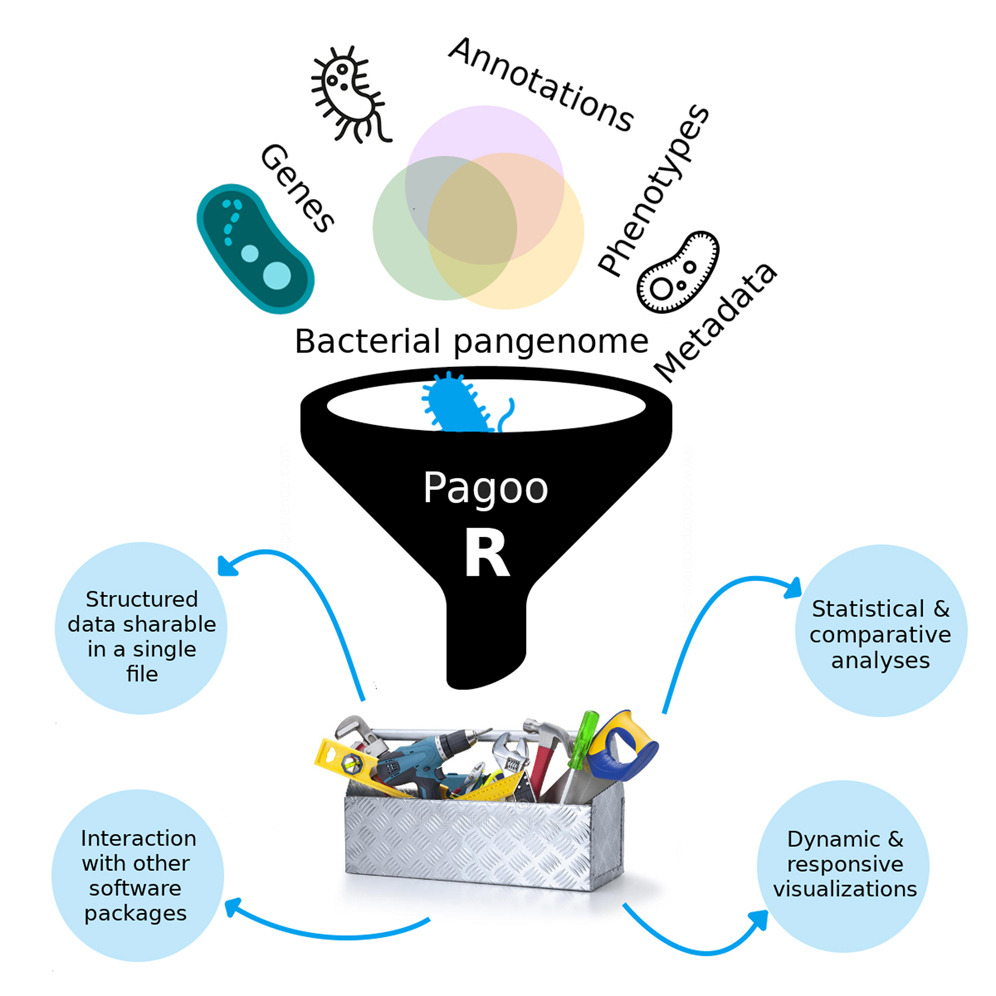

<!-- badges: start -->
[](https://cran.r-project.org/package=pagoo)
[](https://github.com/iferres/pagoo/actions)

[](https://app.codecov.io/gh/iferres/pagoo)
<!-- badges: end -->

# Pagoo: An encapsulated Object-Oriented framework for analyzing bacterial pangenomes in R

*"One object to store them all, one object to find them, one object to query from and with ggplot2 visualize them." (Lord Sauron)*



## Introduction

`pagoo` is an encapsulated, object-oriented class system for analyzing bacterial pangenomes. It uses the [R6](https://r6.r-lib.org/) package as backend. It was designed in order to facilitate and speed-up the comparative analysis of multiple bacterial genomes, standardizing and optimizing routine tasks performed everyday. There are a handful of things done everyday when working with bacterial pangenomes: subset, summarize, extract, visualize and store data. So, `pagoo` is intended to facilitate these tasks as much as possible. 


## Information and Tutorials

Please visit [pagoo webpage](https://iferres.github.io/pagoo/) for more resources.

## Installation

`pagoo` is available at CRAN:
```r
install.packages("pagoo")
```

Alternatively you can install the latest dev version from GitHub using `devtools`:
``` r
if (!require("devtools")) install.packages("devtools")
devtools::install_github('iferres/pagoo')
```

## Citation
If you use `pagoo`, please cite:

[An object-oriented framework for evolutionary pangenome analysis.](https://www.cell.com/cell-reports-methods/fulltext/S2667-2375(21)00140-5)

```
Ignacio Ferrés, Gregorio Iraola.
An object-oriented framework for evolutionary pangenome analysis.
Cell Reports Methods, Volume 1, Issue 5, 2021, 100085, ISSN 2667-2375, https://doi.org/10.1016/j.crmeth.2021.100085.
```

The scripts that support the publication are available [here](https://github.com/iferres/pagoo_publication_scripts). If you want to reproduce the analyses, a [Singularity](https://sylabs.io/singularity/) definition file to build a container with all dependencies is also provided in the above repository. An already built singularity container is hosted at [singularity-hub](https://singularity-hub.org/collections/5123).

A companion protocol paper is also available:

[Protocol for post-processing of bacterial pangenome data using Pagoo pipeline](https://star-protocols.cell.com/protocols/1048)

```
Ignacio Ferrés, Gregorio Iraola.
Protocol for post-processing of bacterial pangenome data using Pagoo pipeline.
STAR Protocols, Volume 2, Issue 4, 2021, 100802, ISSN: 2666-1667, https://doi.org/10.1016/j.xpro.2021.100802
```
